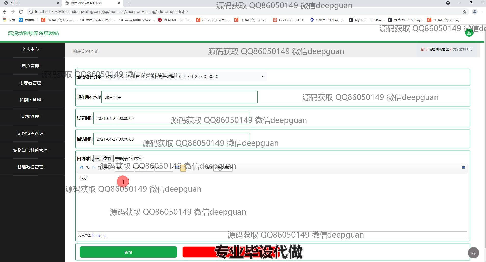
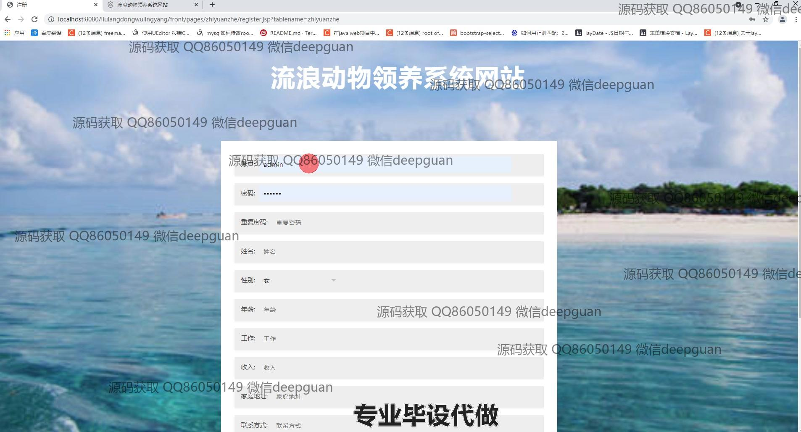

<h1 align="center">流浪动物领养系统网站</h1>

## 简介
流浪动物领养系统：角色分为管理员、用户、志愿者；功能包括宠物管理、领养申请、用户注册与登录、志愿者管理、宠物知识科普、订单管理、宠物回访记录和动态筛选功能，旨在提升领养效率与用户体验。    --计算机毕业设计源码；毕设源码；java毕业设计源码

## 联系方式

<h3 align="center">获取完整代码与数据库文件 + 微信：deepguan QQ: 86050149 QQ群: 783742310</h3>

<h3 align="center">可帮忙远程部署 包运行成功！提供远程部署、修改代码、设计文档指导、代码讲解等服务！</h3>

## 功能介绍（完整见运行截图）
管理员：基本功能包括登录、用户管理、宠物管理、志愿者管理和领养管理。可以添加、查看和更新网站的各种数据，审核用户领养申请，以及管理和展示流浪动物的详细信息。可以管理网站的前端显示内容，包括轮播图、宠物知识和信息更新。通过高效的后台操作，保证网站的顺利运行和流浪动物的领养流程管理。

用户：基本功能包括注册、登录和退出。用户可以在网站首页浏览待领养的宠物信息，查看详细资料，并提交领养申请。用户中心提供个人信息的查看与修改，以及查询过去的领养记录。用户可以收藏感兴趣的宠物，并应用搜索和筛选工具来找到符合自己需求的领养对象。

志愿者：志愿者通过注册和登录后，能够参与到流浪动物的领养管理工作中。可以查看志愿者信息列表，包括姓名、联系方式以及参与活动记录，并添加或更新志愿者活动信息。志愿者还能对宠物的照护和信息记录进行协助输入和管理。

领养者：可通过注册成为领养者，浏览网站上展示的待领养动物。通过填写预约信息和提交领养申请来参与流浪动物领养活动。领养者可以查看领养订单和返回订单情况，并根据管理员的批准进行试养。此外，还可进行领养回访信息的编辑和更新，帮助管理和追踪领养后的宠物状况。

## 运行截图

本代码来源于网络,仅供学习参考使用!

